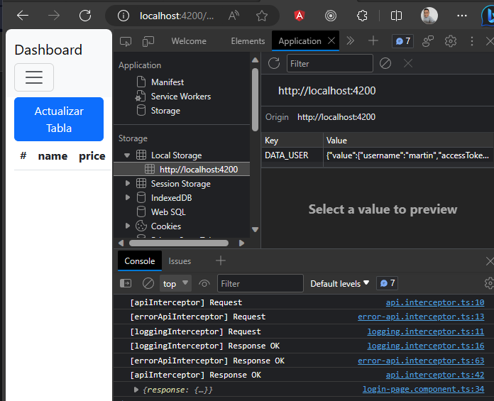

# [Refresh Token con Angular 16](https://www.youtube.com/watch?v=aolGFrOPkVk)

This project was generated with [Angular CLI](https://github.com/angular/angular-cli) version 16.1.7.

Tutorial tomado del canal de youtube `LogiDev`

---

## [¿Cómo trabajar con HttpClient en Aplicación Standalone?](https://blog.ninja-squad.com/2022/11/09/angular-http-in-standalone-applications/)

Durante mucho tiempo, `HttpClient` fue proporcionado por el `HttpClientModule` que importábamos en el módulo de la aplicación.

````typescript
@NgModule({
  declarations: [
    AppComponent
  ],
  imports: [
    BrowserModule,
    AppRoutingModule,
    HttpClientModule,
  ],
  providers: [],
  bootstrap: [AppComponent]
})
export class AppModule { }
````

Cuando se introdujeron las `standalone APIs` en Angular v14, se abrió la puerta a escribir aplicaciones sin módulos.

El equipo de Angular introdujo una función `importProvidersFrom()`, que se podía usar en la función `bootstrapApplication()` para importar proveedores desde un módulo existente, ya que la mayor parte del ecosistema estaba estructurado en torno a módulos.

Entonces, **para proporcionar HttpClient en una aplicación standalone**, podrías hacer:

````typescript
import { bootstrapApplication, importProvidersFrom } from '@angular/core';
import { HttpClientModule } from '@angular/common/http';

bootstrapApplication(AppComponent, {
  providers: [importProvidersFrom(HttpClientModule)]
});
````

### Uso de provideHttpClient()

Pero desde `Angular v15`, esto puede ser reemplazado por `provideHttpClient()`, una nueva función que hace lo mismo que `importProvidersFrom(HttpClientModule)`:

````typescript
import { bootstrapApplication } from '@angular/core';
import { provideHttpClient } from '@angular/common/http';
import { AppComponent } from './app.component';

bootstrapApplication(AppComponent, {
  providers: [provideHttpClient()]
});
````
De esa manera, `HttpClient estará entonces disponible para inyección en su aplicación`.

`provideHttpClient()` es más **"tree-shakable"** que importar HttpClientModule, ya que puede habilitar las funciones que desee dándole algunos parámetros.

## [Functional Interceptors](https://blog.ninja-squad.com/2022/11/09/angular-http-in-standalone-applications/)

En Angular, los interceptores son clases que implementan la interfaz `HttpInterceptor`. Se utilizan para interceptar solicitudes y respuestas HTTP y se pueden usar para agregar encabezados, registrar solicitudes, etc.

````typescript
@Injectable({providedIn: 'root'})
export class LoggerInterceptor implements HttpInterceptor {
  intercept(req: HttpRequest<any>, next: HttpHandler): Observable<HttpEvent<any>> {
    console.log(`Request is on its way to ${req.url}`);
    return next.handle(req);
  }
}
````

Desde `Angular v15`, también puedes usar `interceptores funcionales`. Son funciones que toman como parámetros una Http Request y un Http Handler:

````typescript
export const loggerInterceptor: HttpInterceptorFn = (req: HttpRequest<unknown>, next: HttpHandlerFn): Observable<HttpEvent<unknown>> => {
  const logger = inject(Logger);
  logger.log(`Request is on its way to ${req.url}`);
  return next(req);
}
````

## Creando Interceptor Functional

Como estamos trabajando con Angular 16 crearemos los interceptores usando funciones y ya no con clases como lo hacíamos anteriormente. Para eso solo necesitamos agregar la bandera `--functional` y el CLI creará el interceptor de manera funcional:

````bash
ng g interceptor commons/interceptors/api --functional --skip-tests
````

Como resultado tendremos:

````typescript
import { HttpInterceptorFn } from '@angular/common/http';

export const apiInterceptor: HttpInterceptorFn = (req, next) => {
  return next(req);
};
````

Si vemos el `HttpInterceptorFn` veremos que es un `type` cuya firma corresponde con la función de nuestro interceptor:

````typescript
export declare type HttpInterceptorFn = (req: HttpRequest<unknown>, next: HttpHandlerFn) => Observable<HttpEvent<unknown>>;
````

## Registrando Interceptores basado en Funciones

Los interceptores funcionales **deben registrarse** mediante `withInterceptors()`:

````typescript
import { bootstrapApplication } from '@angular/core';
import { provideHttpClient, withInterceptors } from '@angular/common/http';
import { AppComponent } from './app.component';

bootstrapApplication(AppComponent, {
  providers: [provideHttpClient(withInterceptors([loggerInterceptor]))]
});
````

Siguiendo con lo desarrollado en este proyecto, nosotros registraremos nuestros interceptores en la clase de configuración `app.config.ts`, es lo mismo que en el ejemplo anterior solo que en nuestro caso lo tenemos separado para mayor orden:

````typescript
export const appConfig: ApplicationConfig = {
  providers: [
    provideRouter(APP_ROUTES),
    provideHttpClient(withInterceptors([apiInterceptor, errorApiInterceptor])) //El orden definido de los interceptores en el array ¡SÍ IMPORTA!, será el orden en el que serán ejecutados.
  ]
};
````

**IMPORTANTE**

> El orden definido en el array de los interceptores `Sí importa`, será el orden en el que serán ejecutados. En nuestro caso tenemos: `provideHttpClient(withInterceptors([apiInterceptor, errorApiInterceptor]))`, lo que significa que primero se ejecutará el interceptor `apiInterceptor` y luego `errorApiInterceptor`.

## Funcionamiento de Http Interceptor


## Flujo a implementar del Refresh Token


---

# Flujos identificados

**Importante**

> El tutorial solo trabaja con dos interceptores: `apiInterceptor` y el `errorApiInterceptor`, por mi parte agregué un tercer interceptor en este proyecto `loggingInterceptor` con la finalidad de ver la secuencia de ejecución de los mismos, tanto en el `request` como en el `response`.

---

## Login (exitoso)

Este es el flujo feliz, no ocurre ningún error. Vemos que se ejecutan los tres interceptores, según como lo definimos en el archivo `app.config.ts`, esto es para el `request`, mientras que para el `response` vemos que ocurre en el sentido contrario, es decir, la **respuesta del servidor** llega al último interceptor que emitió el `request`, en nuestro caso, al `loggingInterceptor` y así sucesivamente va hacia atrás.



## Obteniendo productos (exitoso)

El flujo para obtener los productos es similar al flujo realizado en el login con una diferencia, en este flujo, en el interceptor `apiInterceptor` clonamos el `request` y le asignamos a la cabecera el `accessToken`:

````typescript
// api.interceptor.ts
const cloneRequest = refreshTokenManagerService.addTokenHeader(req);
  return next(cloneRequest)
    .pipe(
      tap(apiInterceptorHandlers)
    );
````

Aquí observamos cómo es que estamos clonando el request asignándole a la cabecera el `accessToken` que requiere la solicitud para obtener los productos.

````typescript
// refresh-token-management.service.ts

 addTokenHeader(req: HttpRequest<unknown>): HttpRequest<unknown> {
    const user = this.getDataUser();
    const token = req.url === URL_AUTH_REFRESH ? user.refreshToken : user.accessToken; //Ver comentario más extenso en el código fuente
    console.log(`Token asignado en el header: ${token}`);

    return req.clone({
      headers: req.headers.set('Authorization', `Bearer ${token}`)
    });
  }
````


